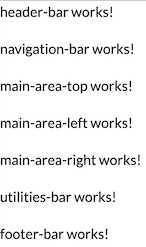
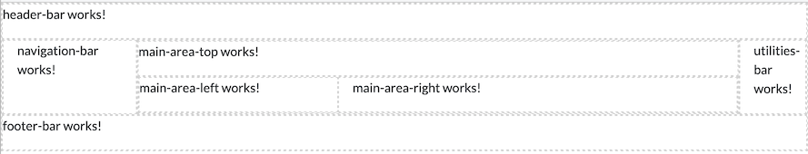
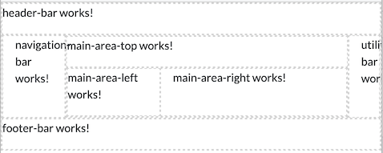

# Unit 5: Boostrap, composition and CSS

## Dependencies

You will need to install the guidelines for styling ALMA UIs,
a thin CSS layer on top of 
[Bootstrap](https://getbootstrap.com/docs/5.0/layout/containers/):

```text
npm install @almaobservatory/ui-guidelines-styles
```

You will need to import those definitions in _styles.css_:
```css
@import "~@almaobservatory/ui-guidelines-styles/dist/alma-ui-guidelines.css";
```

and you'll need to import the _Lato_ font into _index.html_:

```html
  <link href='http://fonts.googleapis.com/css?family=Lato:400,700' rel='stylesheet' type='text/css'>
```

**NOTE** Web applications running at the OSF must be able to function
even without an Internet connection to the outside world, and it would
not be possible to load a font from an external CDN (Content Delivery 
Network). You would instead
copy the font to your application's _assets_ directory instead, and
link to it from there.  
That applies to any other resource type as well, including
libraries, icons, images and CSS definitions.

## Building blocks 

```text
ng generate component header-bar
ng generate component navigation-bar
ng generate component main-area-top
ng generate component main-area-left
ng generate component main-area-right
ng generate component utilities-bar
ng generate component footer-bar
```

_app.component.html_:

```html
<app-header-bar></app-header-bar>
<app-navigation-bar></app-navigation-bar>
<app-main-area-top></app-main-area-top>
<app-main-area-left></app-main-area-left>
<app-main-area-right></app-main-area-right>
<app-utilities-bar></app-utilities-bar>
<app-footer-bar></app-footer-bar>
```

This is how it looks:



## Containers, rows and columns

We begin our composition effort by introducing a Bootstrap _container_ 
element, the outermost element. `container-fluid` takes up
the full width of the viewport (_app.component.html_):

```html
<div class="container-fluid">
  ...
</div>
```

**NOTE** There are several variants of `container`, 
aimed at _responsive_ layouts – that is, layouts accommodating
rotating screens of different sizes.  
Container names like `container-sm` or `container-lg`are related
to responsive layouts and "breakpoints", and
**do not** describe the size of the container.  
The same applies to other Bootstrap elements, like `col-sm`.

Inside our container we'll define a _grid_ of elements. Bootstrap's 
grid is (now) built on the 
[CSS flexbox](https://css-tricks.com/snippets/css/a-guide-to-flexbox/) 
and defines rows and columns of components. We rearrange our building
blocks in three rows:
```html
<div class="container-fluid">
    <!-- Header row -->
    <div class="row">
        <app-header-bar></app-header-bar>
    </div>

    <!-- Main row -->
    <div class="row">
        <app-navigation-bar></app-navigation-bar>
        <app-main-area-top></app-main-area-top>
        <app-main-area-left></app-main-area-left>
        <app-main-area-right></app-main-area-right>
        <app-utilities-bar></app-utilities-bar>
    </div>
    
    <!-- Footer row -->
    <div class="row">
        <app-footer-bar></app-footer-bar>
    </div>
</div>
```

Then arrange the main row in three columns, the left-side navigation
bar, the right-side utilities bar, and a central area with the main
application elements:

```html
    <!-- Main row -->
    <div class="row">
        <div class="col">
            <app-navigation-bar></app-navigation-bar>
        </div>
        
        <!-- Main area -->
        <div class="col">
            <app-main-area-top></app-main-area-top>
            <app-main-area-left></app-main-area-left>
            <app-main-area-right></app-main-area-right>
        </div>

        <div class="col">
            <app-utilities-bar></app-utilities-bar>
        </div>
    </div>
```

Finally we reorganize the main area in two rows, the second being
shared by the _left_ and _right_ components:
```html
        <!-- Main area -->
        <div class="col">
            <div class="row">
                <app-main-area-top></app-main-area-top>
            </div>

            <div class="row">
                <div class="col">
                    <app-main-area-left></app-main-area-left>
                </div>
                <div class="col">
                    <app-main-area-right></app-main-area-right>
                </div>
            </div>
        </div>
```
Our container now looks like this (added a border style for clarity):


## The 12-column system

In a Bootstrap grid, rows are containers for columns. 
Every row allows up to 12 columns and one can specify 
how many of those 12 should be taken up by an actual column.
By default, as we saw, columns share their container in equal parts.

We can now assign 2 columns to the navigation bar, one to the 
utility bar, and let the main component take up the rest. Inside the main
area (which allows the full complement of 12 "virtual" columns), 
we reserve 8 columns for the _right_ area and let the _left_ area take up the rest:

```html

    <!-- Main row -->
    <div class="row">
        <div class="col-2">
            ...
        </div>
        
        <!-- Main area -->
        <div class="col">
            <div class="row">
                ...
            </div>

            <div class="row">
                <div class="col">
                    ...left...
                </div>
                <div class="col-8">
                    ...right...
                </div>
            </div>
        </div>

        <div class="col-1">
            ...
        </div>
    </div>
```

Our finely composed container now looks like this:



Proportions will be kept if we resize the window:



**NOTE** In a reactive layout, components would instead _break_ 
away from each other 
and slid below.
